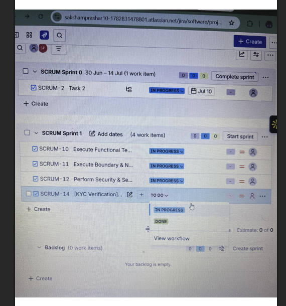
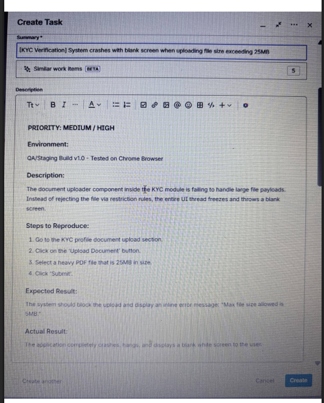
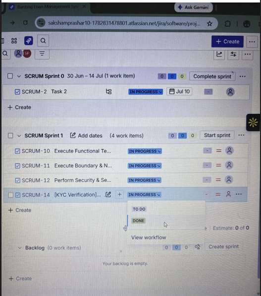

# End-to-End Banking Loan Management Testing Project

## Project Overview
This project simulates a comprehensive Quality Assurance testing cycle on a Banking Loan Management System module (specifically focusing on KYC and Identity Verification). The objective was to design structural test scenarios, execute functional, boundary, and negative validations, and manage the defect tracking life cycle using Agile Scrum principles in Jira Cloud.

## Test Artifacts
* **Complete Test Case Matrix:** [Click here to view Banking_Loan_Management_System_Test_Cases_30.xlsx](./Test_Artifacts/Banking_Loan_Management_System_Test_Cases_30.xlsx)
* Total Cases Executed: 30 Manual Test Cases covering identity verification formats, PAN validation, facial clarity limits, duplicate profiles, and input validation bounds.

## Defect Management Lifecycle (Jira Cloud)
To maintain structural compliance with professional development setups, I tracked all executions inside Jira using a dedicated Scrum Sprint framework.

### 1. Defect Logged & Added to Sprint (Status: TO DO)
* Identified the KYC file upload crash during boundary execution tracks.
* Logged under issue key `SCRUM-14` and initialized in the active sprint backlog.

### 2. Isolated Critical Bug Record (SCRUM-14 Details)
* Complete production-grade bug report documentation inside Jira featuring reproduction steps, environment scope, expected vs actual behaviors, and severity indexing.

### 3. Simulating Dev Hand-off (Status: IN PROGRESS)
* Transitioned the defect lifecycle to state `IN PROGRESS` to demonstrate correct agile alignment and cross-functional task tracking.

